**项目简介**

本项目面向智慧教育场景，研究能够理解文字、图片、视频、语音和历史对话的智能对话技术。通俗地说，就是让机器不仅能“读懂文字”，还能够“看懂题目图片、理解实验视频、听懂语音提问、记住前后文”，从而更准确地回答学生问题。项目围绕学生问题理解、多模态信息选择、知识图谱推理、多轮对话生成和智慧教育机器人验证等内容开展研究，建立了多媒体智慧教育对话系统原型，并在真实教学场景中进行了应用验证。

**研究背景与社会价值**

随着人工智能、大数据和多媒体技术的发展，人机交互正在从单一的文字问答，逐步走向融合文本、图像、视频、语音等多种信息形式的智能对话。现实生活中的问题往往并不只是简单的一句话，而是常常伴随着图片、视频、语音和上下文信息。例如，学生可能上传一道题目图片并继续追问解题思路；患者或公众可能通过文字、图片和语音描述健康疑问并希望获得科普性解释；消费者可能结合商品图片咨询搭配建议；游客也可能拍摄景点视频询问历史背景。这些场景都说明，能够理解多媒体信息并进行自然交流的人机对话系统，正在成为人工智能应用中的重要基础技术。

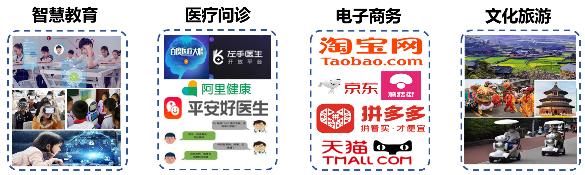

**研究问题**

传统对话系统通常更擅长处理文字信息，但现实中的人机对话往往发生在复杂场景中，问题也常常与图片、视频、语音、知识点和历史记录交织在一起，因此容易遇到三类关键困难：一是**场景感知误差**，即面对智慧教育、医疗问诊、文化旅游、电子商务等不同场景时，系统难以准确理解复杂语义和用户真实意图；二是**对话模态单一**，即系统难以跨越文字、图像、视频、语音等多模态之间的语义鸿沟，不能根据问题选择最合适的回答形式；三是**上下文碎片化**，即多轮对话中的历史记录包含多种模态信息，系统匹配和关联能力不足，容易造成对话不连贯。项目正是围绕这三类问题，开展多模态环境下的多媒体对话分析与理解关键技术研究。

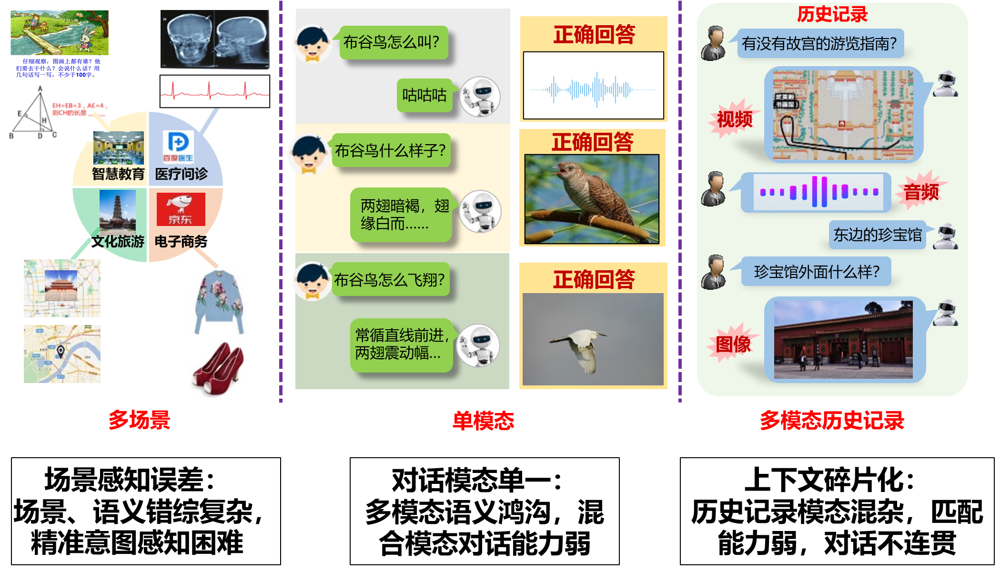

**研究方法**

项目针对场景感知误差、对话模态单一和上下文碎片化等问题，项目主要通过三个研究内容来提升多媒体对话系统的理解与回答能力。

第一，建立**面向任务场景适应的知识图谱与知识推理**，让系统具备更丰富的场景知识。项目通过构建面向不同应用场景的知识图谱，为机器建立一张类似“知识地图”的结构，帮助系统理解概念、对象和事件之间的关系。例如，在智慧教育、医疗问诊、文化旅游等场景中，系统不仅要识别用户提到的关键词，还要理解这些信息背后的知识联系，从而给出更可靠的回答。

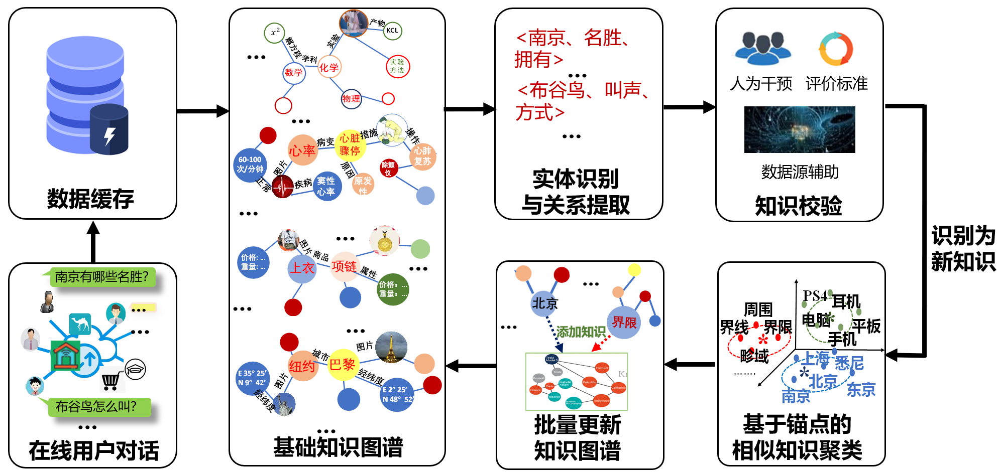

第二，研究**基于特征重构的模态选择与答案生成方法**，让系统学会判断同一个问题更适合用文字、图片、音频还是视频回答，从而提供更直观、更自然的多模态答案。现实对话中，不同问题适合不同的回答方式：例如“布谷鸟怎么叫”更适合用音频回答，“熊猫长什么样”更适合用图片回答，“如何去太和殿”则更适合结合文本说明和路线图进行回答。

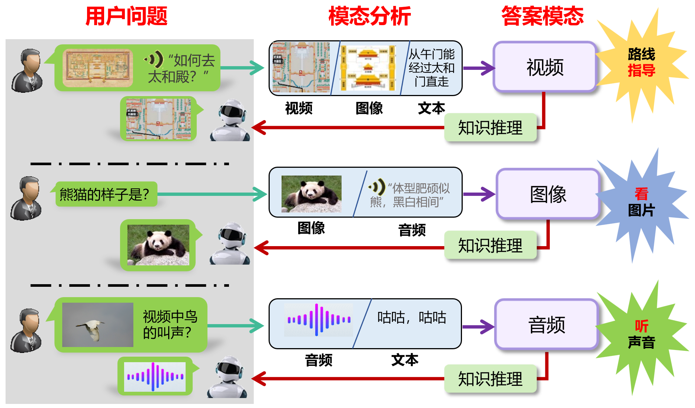

第三，构建**基于跨模态注意力的上下文连续对话方法**，让系统能够理解连续对话。真实交流往往不是一次性问答，用户会不断追问、补充或省略前文内容。项目通过跨模态注意力机制，使系统能够把历史对话中的文字、图片、视频和语音信息联系起来，记住前文线索，理解用户当前问题的真实含义，从而在多轮交流中保持回答连贯、准确。

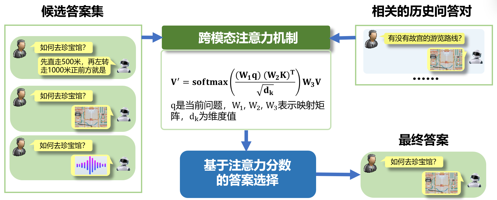

**主要研究成果**

本项目面向多模态环境下的多媒体对话分析与理解，重点应对三类挑战：一是**多模态知识适配与协同难**，大小模型间知识迁移效率不足；二是**跨模态语义关联学习与匹配差**，文本、图像、视频间易出现语义不一致；三是真实场景中**用户多模态数据语义感知弱**。为此，项目分别研究**多模态自适应知识蒸馏**、**多模态自适应生成**以及**用户多模态数据分析与语义理解方法**，提升模型轻量化部署、跨模态内容生成和复杂场景语义推理能力。

**一、多模态自适应知识蒸馏**

在多模态对话系统中，面向不同模态的深度网络（教师网络，学生网络）学习能力不同，学生网络难以匹配教师网络和智慧教育数据隐私问题，研究如何实现多模态知识迁移与模型的轻量化部署。

针对当教师模型和学生模型能力差距过大时，会导致学生模型“学不会”的问题。项目提出“**可切换在线知识蒸馏**”方法，让教师模型能够根据学生模型的学习状态，在不同教学模式之间自适应切换：当教师与学生的差距较大时，进入**专家模式**，暂停对教师的训练，同时让学生不断地向教师学习；当学生能力提升后，当教师和学生的差距较小时，进入**学习模式**，教师和学生同时训练。这样可以避免蒸馏过程失效，提高小模型的学习效率。

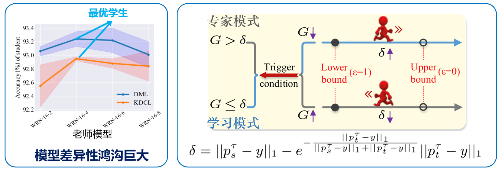

针对智慧教育数据隐私的问题，本项目研究了在无数据条件下的模型压缩方法。与以往仅关注教师模型的数据生成方法不同，项目提出的**自适应数据生成策略**，能同时兼顾教师与学生模型；通过自适应生成适合学生模型学习的样本，在保证数据隐私的前提下，该方法实现了模型轻量化，同时保持了性能，为多模态系统在资源受限环境中的部署提供了可行的解决方案。

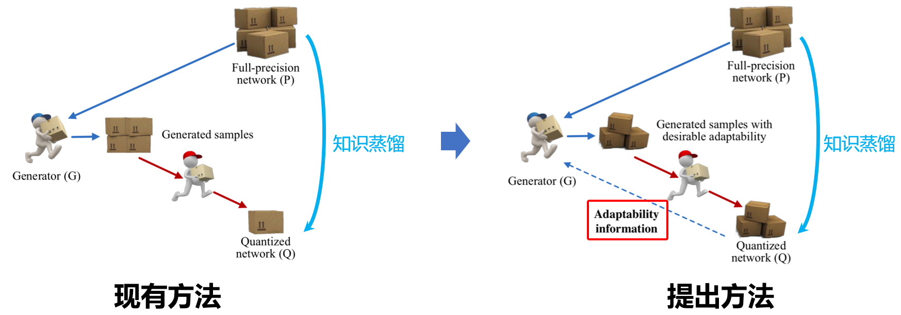

**成果汇总**：

- **Yang Wang**（项目负责人）, B. Qian, H. Liu, Y. Rui, M. Wang. Unpacking Gap Box Against Data-Free Knowledge Distillation. IEEE Trans. Pattern Analysis and Machine Intelligence, IEEE T-PAMI, 2024.

- B. Qian（指导研究生）, **Yang Wang**（项目负责人）, R. Hong, M. Wang. Adaptive Data-Free Quantization. CVPR 2023: 7960-7968.

- B. Qian（指导研究生）, **Yang Wang**（项目负责人）, R. Hong, M. Wang. Rethinking Data-Free Quantization as a Zero-Sum Game. AAAI 2023: 9489-9497.

- B. Qian（指导研究生）, **Yang Wang**（项目负责人）, H. Yin, R. Hong, M. Wang. Switchable online knowledge distillation. ECCV 2022: 449-466.

- Y. Xiao, Z. Tang, **Pengxu Wei**（合作单位负责人）, C. Liu, L. Lin. Masked Images Are Counterfactual Samples for Robust Fine-tuning. CVPR 2023: 20301-20310.

**二、多模态自适应生成**

克服模态信息语义分歧和跨模态语义鸿沟，生成内容语义偏差大的困境，项目研究如何建立并加强跨模态语义关联，消除语义偏差，获得较好的多模态自适应生成。

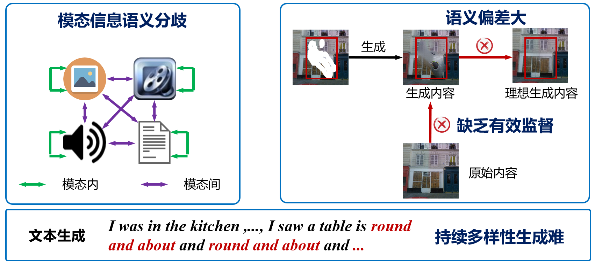

针对少样本指代视频目标分割中跨模态语义学习不足、相似目标实例级跟踪与区分困难的问题，提出跨模态关联与实例序列匹配框架CMA-ISM。该方法通过跨模态关联模块建模文本描述与视频时空区域的细粒度语义一致性，并利用实例序列匹配机制构建稳定的目标时序轨迹，有效缓解少样本条件下的语义指认困难和多目标场景中的漂移、错配问题。实验结果如下所示：

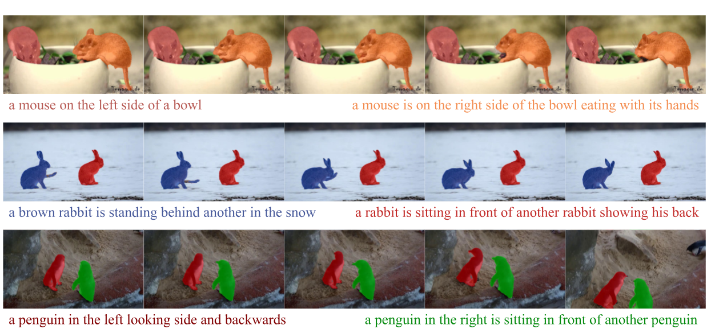

此外，为了应对文本引导图像修复中不同频率信息对去噪响应不同的问题，项目提出空文本-频率感知扩散模型，通过中低频信息的解耦和分阶段空文本引导策略，兼顾修复内容的语义一致性与背景保留，实现了结构稳健、细节丰富、语义统一的图像生成效果。修复结果如下所示：

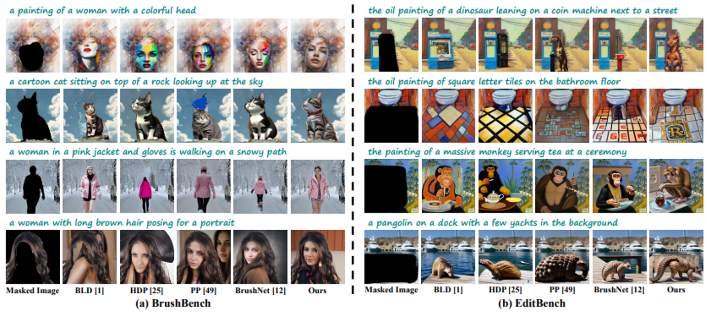

针对扩散模型在图像修复时容易导致遮挡区域与非遮挡区域语义不一致的问题，项目提出利用稀疏结构信息引导纹理生成的方法，使修复区域与原图在结构和语义上保持协调，从而生成更加自然的图像。修复结果如下所示：

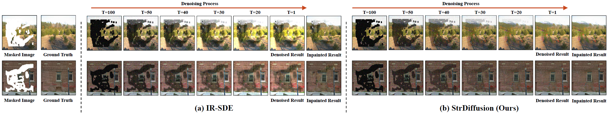

针对真实场景中突发图像超分辨率重建面临的多帧数据不一致、设备差异及人为抖动导致的图像退化问题，提出基于多帧信息融合的超分辨率重建方法。该方法首先构建真实突发图像超分辨率重建数据集，并通过多帧像素对齐消除帧间偏移，筛选差异性特征以增强有效信息表达，进一步利用注意力机制融合多帧互补信息，从而重建更加真实、清晰的超分辨率图像。

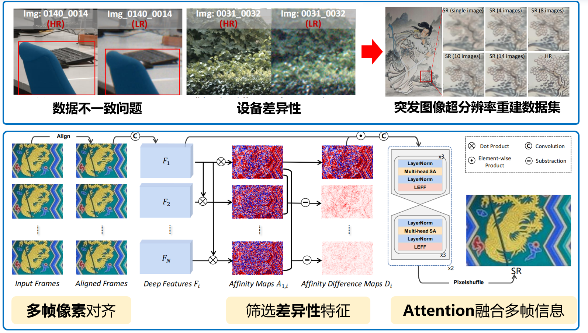

针对传统方法难以挖掘复杂文本中的词语级与句子级语义，导致生成图像与文本描述不匹配的问题，提出文本引导的精细化图像合成方法。该方法通过多粒度注意力机制实现图文语义对齐，并采用局部词语级和全局句子级的多阶段生成策略，由粗到细融合跨模态信息，提升图像生成的一致性。

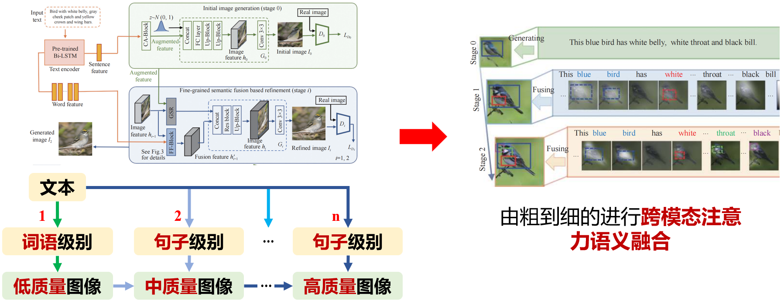

**成果汇总：**

- H. Liu, G. Li, M. Gao, X. Zhen, Feng Zeng, **Yang Wang**（项目负责人）. Few-shot referring video single-and multi-object segmentation via cross-modal affinity with instance sequence matching. International Journal of Computer Vision, 2025, 133(8): 5610-5628.

- H. Liu（指导研究生）, **Yang Wang**（项目负责人）, M. Wang. One Stone with Two Birds: A Null-Text-Null Frequency-Aware Diffusion Models for Text-Guided Image Inpainting. NeurIPS 2025, San Diego.

- H. Liu（指导研究生）, **Yang Wang**（项目负责人）, B. Qian, M. Wang, Y. Rui. Structure Matters: Tackling the Semantic Discrepancy in Diffusion Models for Image Inpainting. CVPR 2024, Seattle, USA.

- Q. Zhao, W. Deng, **Pengxu Wei**（合作单位负责人）, Z. Dong, H. Lu, X. Ji, L. Lin. Delving into Cascaded Instability: A Lipschitz Continuity View on Image Restoration and Object Detection Synergy. NeurIPS 2025, San Diego.

- X. Gao（团队成员）, **Yang Wang**（项目负责人）, M. Wang. Macroscopic-and-Microscopic Rain Streaks Disentanglement Network for Single-Image Deraining. IEEE Transactions on Image Processing, 2023, 32: 2663-2677.

- H. Sun（指导研究生）, **Yang Wang**（项目负责人）, H. Liu, B. Qian. Fine-grained Cross-modal Fusion based Refinement for Text-to-Image Synthesis. Chinese Journal of Electronics, 2023, 32(6): 1329-1340.

- H. Liu（指导研究生）, **Yang Wang**（项目负责人）, M. Wang, Y. Rui. Delving Globally into Texture and Structure for Image Inpainting. ACM Multimedia 2022: 1270-1278.

- Z. Dong, Y. Xiao, **Pengxu Wei**（合作单位负责人）, L. Lin. Decoder-only LLMs are better controllers for diffusion models. ACM Multimedia 2024: 10957-10965.

- **Pengxu Wei**（合作单位负责人）, Y. Sun, X. Guo, C. Liu, G. Li, J. Chen, X. Ji, L. Lin. Towards Real-World Burst Image Super-Resolution: Benchmark and Method. ICCV 2023: 13233-13242.

**三、用户多模态数据分析与语义理解**

针对真实应用中多模态数据语义感知弱的问题，研究多模态跨域鲁棒匹配、语义理解与推理方法。通过融合用户文本、图像、视频及交互行为等多源信息，构建面向用户场景的多模态语义分析模型，提升复杂环境下的语义感知、关系挖掘和意图理解能力。

针对在情感感知推荐中，不同用户在相同情绪下音乐偏好存在差异的问题，项目提出了一种考虑用户异质性的深度贝叶斯网络，将用户的情绪信息、群体差异和兴趣偏好统一建模，从而实现更细致、个性化的音乐推荐。

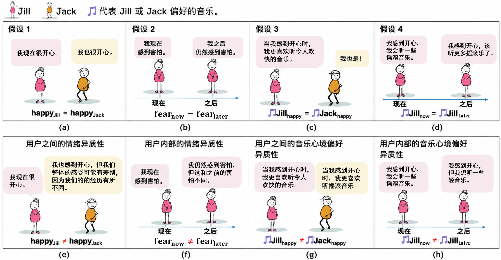

针对知识增强推荐中用户兴趣之间存在复杂关联、跨域推荐难以捕捉潜在关系的问题，项目提出了用户兴趣马尔可夫树方法，通过逐级建模用户兴趣及其与知识图谱中实体的潜在关联，使系统能够更准确地推理用户兴趣并进行个性化推荐。

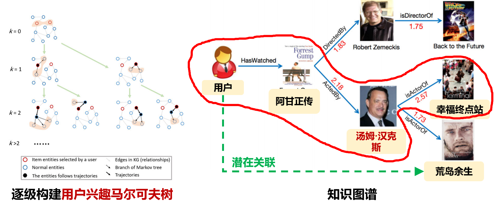

**成果汇总：**

- H. Liu, G. Li, M. Gao, X. Zhen, Feng Zeng, **Yang Wang**（项目负责人）. Few-shot referring video single-and multi-object segmentation via cross-modal affinity with instance sequence matching. IJCV 2025, 133(8): 5610-5628.

- J. Peng, Z. Tao, H. Wang, M. Wang, **Yang Wang**（项目负责人）. Boosting Adversarial Transferability via Residual Perturbation Attack. ICCV 2025: 1261-1270.

- L. Qi, H. Wang, J. Zhang, J. Peng, **Yang Wang**（项目负责人）. Unsupervised domain adaptive person search via dual self-calibration. AAAI 2025, 39(6): 6550-6558.

- E. Jing, Y. Liu, Y. Chai, S. Yu, L. Liu, Y. Jiang, **Yang Wang**（项目负责人）. Emotion-aware personalized music recommendation with a heterogeneity-aware deep bayesian network. ACM TOIS 2025, 43(5): 1-43.

- **Pengxu Wei**（合作单位负责人）, Z. Xie, G. Li, L. Lin. Taylor Neural Network for Real-World Image Super-Resolution. IEEE Transactions on Image Processing, 2023, 32: 1942-1951.

- Y. Zheng, **Pengxu Wei**（合作单位负责人）, Z. Chen, C. Tang, L. Lin. Routing User-Interest Markov Tree for Scalable Personalized Knowledge-Aware Recommendation. IEEE Transactions on Neural Networks and Learning Systems, 2023.

- Z. Dong, **Pengxu Wei**（合作单位负责人）, L. Lin. Adversarially-Aware Robust Object Detector. ECCV 2022: 297-313.

- **Yang Wang**（项目负责人）, J. Peng, H. Wang, M. Wang. Progressive learning with multi-scale attention network for cross-domain vehicle re-identification. Science China Information Sciences, 2022, 65(6): 160103.（中国科学信息科学 2024 年度热点论文奖）

**授权发明专利：**

1. 王杨；刘海鹏；汪萌. 基于全局纹理与结构的图像修复方法，ZL 202210535815.4，中国. 已授权.

2. 王杨；钱彪；刘海鹏；汪萌. 可切换在线知识蒸馏的图像分类方法、装置及可存储介质，ZL 202210747314.2，中国. 已授权.

3. 王杨；刘海鹏；易泽乾；钱彪；张海澜；汪萌. 一种基于ID的轻量级元嵌入推荐方法及系统，ZL 202411313058.1，中国. 已授权.

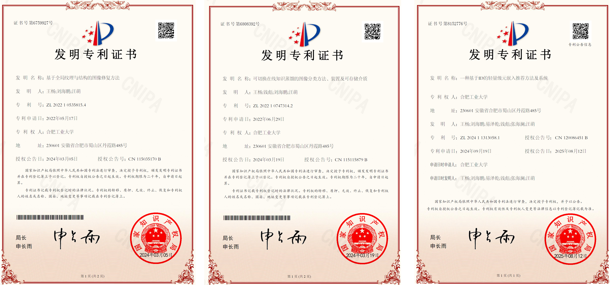

**数据知识产权成果**

暗物智能科技(广州)有限公司，暗物智能多模态问答对话数据，获评2024年广东省数据知识产权十大典型案例，2024-05-06，粤2024040300183.

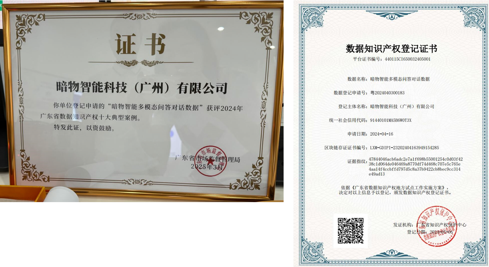

该数据集面向“多模态环境下的多媒体对话分析和理解”任务构建，主要包含文本对话、图像、音频和视频等多种模态数据。数据集中包含语音、图像和视频信息的对话占比分别约为20%、15%和10%，且不同模态可在同一对话中重叠出现。最终数据以JSON格式的对话集为核心，同时交付视频集、图像列表和音频列表，为多模态对话理解、跨模态语义分析和多媒体内容处理研究提供数据支撑。

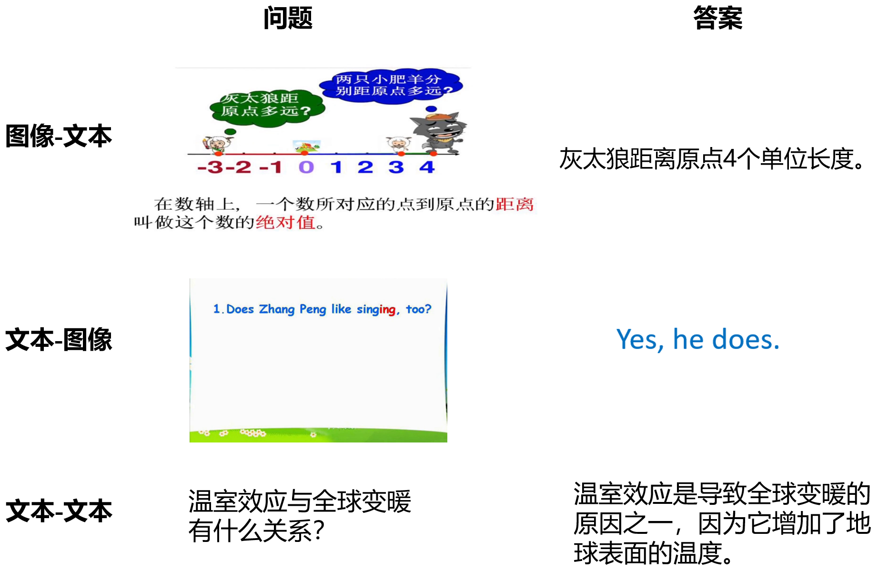

**常见问题与科普解读**

#### Q1：什么是“多模态”？

A：多模态就是多种信息形式。文字、图片、视频、语音、动作、历史记录都可以是模态。人类交流天然是多模态的，机器要更自然地与人对话，也需要同时理解多种模态。

#### Q2：为什么普通聊天机器人还不够？

A：普通聊天机器人往往主要处理文字，而智慧教育中的问题经常涉及题目图片、实验视频、语音提问和多轮追问。如果系统看不懂图像视频，也记不住上下文，就很难提供准确解释。

#### Q3：什么是“多媒体对话系统”？

A：多媒体对话系统是能够理解和处理多种媒体信息的智能问答系统。它不只接收文字，还可以结合图片、视频、语音等信息来理解用户问题，并根据问题内容选择文字、图片、音频或视频等更合适的方式进行回答。

#### Q4：多媒体对话系统会不会替代老师？

A：更准确的定位是辅助老师和学生。系统可以帮助完成即时答疑、资料推荐、步骤解释和个性化反馈，但教育中的情感引导、价值塑造和复杂教学决策仍需要教师发挥核心作用。
